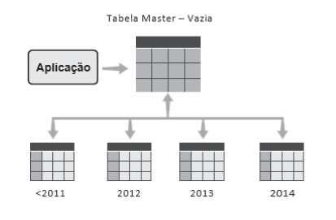
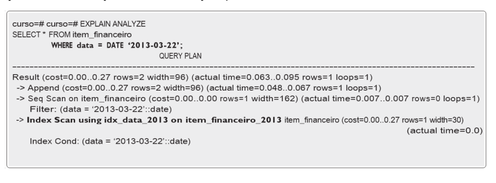
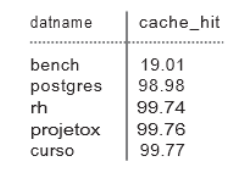
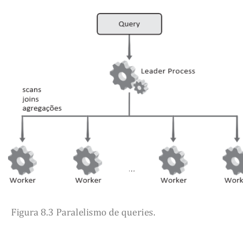
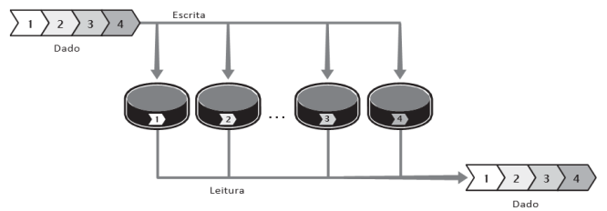
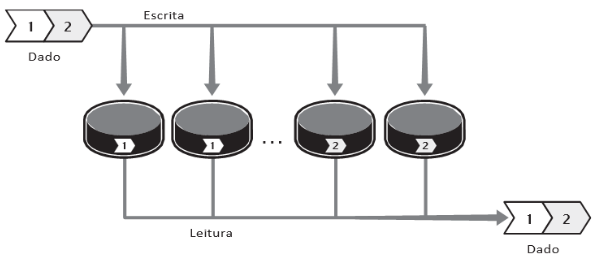
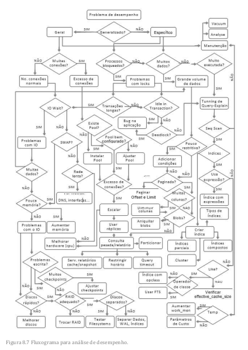

# Modulo 8 - Desempenho: tópicos sobre configuração e infraestrutura

tags
> Full-Text Search; Indexadores de Documentos; Índices GIN; Operadores de Classe; Cluster; Particionamento; Memória de Ordenação; Escalabilidade; Filesystem e RAID.

## Busca em texto

### Like/ilike (case insensitive)

- gera problemas de desempenho em queries
- uma coluna do tipo texto que está sendo utilizado pelo comando like, pode estar indexada e não ser utilizado pelo 
comando. É preciso utilizar __um operador__ especial no momento da criaçãodo índice para que operações com LIKE possam aproveitá-lo.

Esse operador depende do tipo da coluna:

|||
|--|--|
|Varchar|varchar_pattern_ops|
|Char|bpchar_pattern_ops|
|Text|text_pattern_ops|

Criar um índice que possa ser pesquisado pelo LIKE

~~~sql
curso=\# CREATE INDEX idx_like ON times(nome varchar_pattern_ops);
~~~

Outro motivo para o PostgreSQL não utilizar os índices numa query com LIKE é se for usado % no início da string, significando que pode haver qualquer coisa antes. Por exemplo:

~~~sql
curso=\# SELECT * FROM times WHERE nome LIKE ‘%Herzegovina%’;
~~~

> Essa cláusula nunca usará índice, mesmo com o operador de classe sempre varrendo a tabela inteira.

### Full-Text Search - FTS

O FTS permite busca __por frases exatas__, uso de __operadores lógicos__ | (or), & (and) e ! (not), __ordenação por relevância__(ranking), destacar os termos pesquisados e diversas outras opções.

Para melhor desempenho e manutenção, fazemos uma preparação prévia:

1. necessário alterar a tabela para utilizar esse recurso, __inserindo uma coluna do tipo tsvector__:

~~~sql
curso=\# ALTER TABLE times ADD COLUMN historia_fts tsvector;
~~~

2. deve-se __copiar e converter o conteúdo da coluna que contém o texto original__ o qual desejamos fazer a busca para a nova coluna “vetorizada”

~~~sql
curso=\# UPDATE times SET historia_fts = to_tsvector(‘portuguese’, historia);
~~~

3. cria-se um __índice do tipo GIN ou GIST__ na coluna vetorizada:

~~~sql
curso=\# CREATE INDEX idx_historia_fts ON times USING GIN(historia_fts);
~~~

Desse ponto em diante, pode-se usar o FTS bastando aplicar, por exemplo, o operador @@ e a função ts_query:

~~~sql
-- buscando todos os registros que contenham as palavras “campo” e “mundo”
curso=\# SELECT nome, historia FROM times WHERE historia_fts @@ to_tsquery (‘portuguese’,’campo & mundo’);
~~~

> Quando criamos a coluna do tipo ts_vector e a carregamos através do update, fizemos isso apenas para os dados existentes. Para __novos dados inseridos__ ou atualizados, é necessário criar uma __trigger__ para alterar também a coluna vetorizada.

> Para se obter uma __taxa de relevância__ dos resultados obtidos, pode-se usar a função __ts_rank__; para fazer o __“highlight”__ do resultado, ou seja, destacar os critérios de busca, usa-se a função __ts_headline__.

Busca por frases onde a ordem e/ou distância entre os termos são importantes (__operador <->__)

~~~sql
-- retorna resultados apenas quando “copa” vem antes de “mundo”, e exatamente a duas posições de distância:
curso=# SELECT nome, historia FROM times WHERE historia_fts @@ to_tsquery(‘portuguese’,’copa <2> mundo’)
~~~

> __Dica__: a extensão pg_trgm adiciona recursos de busca em texto através do método __trigram__. Ele fornece funções e operadores, possibilitando criar índices que aceitam buscas com % no início do LIKE, além de também trabalhar com FTS. Porém, o __tamanho do índice pode ser desproporcionalmente grande__, e o custo de atualização bastante alto

### Softwares indexadores de documentos

Softwares específicos, como o __Lucene__ e __SOLR__ (ambos open source)

Esses softwares __leem os dados do banco periodicamente__ e __criam índices onde são feitas as buscas__. Como normalmente os conteúdos de documentos mudam pouco, essa estratégia é melhor do que acessar o banco a cada vez.

## Organização de tabelas grandes

### Cluster de tabela

Se tivermos uma tabela grande, muito usada, já indexada, e ainda assim com a necessidade de melhorar o acesso a ela, uma possibilidade é o comando __CLUSTER__. 
Essa operação vai ordenar os dados da tabela fisicamente segundo um índice que for informado. É especialmente útil quando são lidas faixas de dados em um intervalo. 

~~~sql
bench=# CLUSTER pgbench_accounts USING idx_accounts_bid;
~~~

### Particionamento de tabelas

Esse procedimento __divide uma tabela em outras menores__, __baseado em algum campo que você definir__, em geral um ID ou uma data. Isso pode trazer benefícios de desempenho, já que as __queries__ farão __varreduras__ em __tabelas menores ou índices menores__. No PostgreSQL, o particionamento é feito de forma declarativa, também chamada __nativa__, ou usando __herança de tabelas__.

### Particionamento Declarativo

Forma mais simples de criar e gerenciar uma estrutura de tabelas particionadas. Ao contrário do particionamento através de herança, __não é necessário criar check constraints e triggers__ manualmente para tratar o direcionamento dos dados para as partições.

Como criar:
1. Criar uma tabela principal, que não terá dados, indicando que será particionável através do atributo __PARTITION BY__

~~~sql
curso=# CREATE TABLE item_financeiro (
            iditem int, data timestamp, descricao varchar(50), valor numeric(10,2)
        ) PARTITION BY RANGE (data);
~~~

2. Criar as tabelas de partições

~~~sql
curso=\# CREATE TABLE item_financeiro_2012 PARTITION OF item_financeiro 
            FOR VALUES FROM (‘2012-01-01’) TO (‘2013-01-01’);
curso=\# CREATE TABLE item_financeiro_2013 PARTITION OF item_financeiro 
            FOR VALUES FROM (‘2013-01-01’) TO (‘2014-01-01’);
curso=\# CREATE TABLE item_financeiro_2014 PARTITION OF item_financeiro 
            FOR VALUES FROM (‘2014-01-01’) TO (‘2015-01-01’);
~~~

3. Criar índices nas colunas chaves de particionamento (não obrigatório mas recomendado devido ao desempenho)

Criar o índice na tabela principal que estes serão automaticamente criados em todas as partições.

~~~sql
curso=# CREATE INDEX ON item_financeiro(data);
~~~

### Formas de particionamento

1. Particionamento RANGE, onde define-se uma faixa de valores com a sintaxe:

~~~text
... PARTITION OF tabela_principal FOR VALUES FROM v1 TO v2;
~~~

2. Usando o atributo __LIST__, cujos valores são explicitamente definidos:

~~~sql
CREATE TABLE tabela_pai (…) PARTITION BY LIST (campo);

CREATE TABLE tabela_filha1 PARTITION OF tabela_principal
    FOR VALUES IN (‘Novo’,’Em Atendimento’,’Em entrega’);

CREATE TABLE tabela_filha2 PARTITION OF tabela_principal
    FOR VALUES IN (‘Entregue’,’Cancelado’,’Devolvido’);
~~~

3. particionamento __por HASH__
Utilizado quando não temos uma chave natural para particionar os dados. Nesta forma de particionamento, é necessário definir um
__modulus (divisor)__ e um remainder (resto__). O Postgres vai gerar um valor hash para o campo chave escolhido e então dividirá esse hash pelo modulus e o registro será direcionado para a partição cujo resto seja igual.

~~~sql
CREATE TABLE tabela_pai (…) PARTITION BY HASH (campo);

CREATE TABLE tabela_filha1 PARTITION OF tabela_principal
    FOR VALUES WITH (modulus 3, remainder 0);

CREATE TABLE tabela_filha2 PARTITION OF tabela_principal
    FOR VALUES WITH (modulus 3, remainder1);

CREATE TABLE tabela_filha3 PARTITION OF tabela_principal
    FOR VALUES WITH (modulus 3, remainder 2);
~~~

### Múltiplos níveis

É possível também ter __múltiplos níveis de particionamento__. 
Por exemplo, uma tabela é particionada por ano e depois cada partição anual pode ser particionada por mês ou status. É possível ter formas diferentes entre os níveis. Por exemplo, o primeiro nível é particionado por RANGE, e o segundo LIST.

### Partição Default

Os dados que não se encaixam nas regras das demais partições são __direcionados__ para a __partição default__. Caso ela __não
exista__ e o valor não se enquadre nas demais, __um erro é gerado__.

Partições default podem ser criadas para as formas RANGE e LIST.

~~~sql
CREATE TABLE tabela_filha PARTITION OF tabela_principal DEFAULT;
~~~

> __OBS__: Apesar de parecer uma ótima ideia à primeira vista, precisar de uma partição default pode significar que você não modelou suas partições corretamente. Além disso, __depois de adicionar uma partição default__, você __não pode__ mais __adicionar partições para novos valores__: será necessário desanexar a partição default, criar a nova partição e mover os dados dela manualmente antes de poder adicionar uma partição default novamente.

### Particionamento por herança

1. Como no particionamento nativo, criar uma tabela principal, que não terá dados, porém sem o atributo PARTITION BY:

~~~sql
curso=\# CREATE TABLE item_financeiro (iditem int, data timestamp, descricao varchar(50), valor numeric(10,2));
~~~

2. Criar as tabelas filhas, herdando as colunas da tabela principal

~~~sql
curso=\# CREATE TABLE item_financeiro_2012 () INHERITS (item_financeiro);

curso=\# CREATE TABLE item_financeiro_2013 () INHERITS (item_financeiro);

curso=\# CREATE TABLE item_financeiro_2014 () INHERITS (item_financeiro);
~~~

3. Adicionar uma __CHECK__ constraint em cada tabela filha, ou partição, para aceitar dados apenas da faixa certa para a partição

~~~sql
curso=\# ALTER TABLE item_financeiro_2012 ADD CHECK (data >= ‘2012-01-01’ AND data < ‘2013-01-01’);
~~~

4. Criar uma trigger na tabela principal, que direciona os dados para as filhas.

~~~sql
curso=\#
CREATE OR REPLACE FUNCTION itemfinanceiro_insert_trigger()
RETURNS TRIGGER AS $$
BEGIN
    IF (NEW.data >= ‘2012-01-01’ AND NEW.data < ‘2013-01-01’) THEN
        INSERT INTO item_financeiro_2012 VALUES (NEW.*);
    ELSIF (NEW.data >= ‘2013-01-01’ AND NEW.data < ‘2014-01-01’) THEN
        INSERT INTO item_financeiro_2013 VALUES (NEW.*);
    ELSIF (NEW.data >= ‘2014-01-01’ AND NEW.data < ‘2015-01-01’) THEN
        INSERT INTO item_financeiro_2014 VALUES (NEW.*);
    ELSE
        RAISE EXCEPTION ‘Data fora de intervalo válido’;
    END IF;

    RETURN NULL;
END;
$$
LANGUAGE plpgsql;
curso=\# CREATE TRIGGER t_itemfinanceiro_insert_trigger 
    BEFORE INSERT ON item_financeiro 
    FOR EACH ROW EXECUTE PROCEDURE itemfinanceiro_insert_trigger();
~~~

5. Criar os índices nas tabelas filhas:

~~~sql
curso=# CREATE INDEX idx_data_2012 ON item_financeiro_2012(data);
~~~

Podemos ver que foi necessário apenas acessar uma partição

### Expurgo de dados particionados

Outra grande vantagem do particionamento está no momento de __apagar dados antigos__.

Utilizando o método tradicional, usa-se um DELETE com uma cláusula WHERE que inclua os registros antigos. Em uma partição com milhões de registros, essa operação é lenta e gera grande quantidade de log de transação. 

Com o particionamento, é possível:
- simplesmente __apagar uma partição antiga com DROP__
- __desanexar__ uma partição do __modo declarativo__ com `ALTER TABLE master DETACH PARTITION partição` ou, 
- no __particionamento por herança__, usando `ALTER TABLE partição NO INHERIT master`

> Para o particionamento funcionar de forma eficiente, é necessário que o __parâmetro__ __constraint_exclusion__ esteja __habilitado__, podendo estar com o __valor “partition” ou “on”, mas não pode estar “off”__

## Procedimentos de manutenção

Destacar três que podem impactar significativamente o desempenho do banco:
- Vacuum
- Estatísticas
- Índices Inchados

### Vacuum

A operação de Vacuum pode afetar o desempenho das tabelas, especialmente se não estiver sendo executada periodicamente, ou sendo executada com pouca frequência.

> Ao analisar uma query específica, executar um __Vacuum manual__ nas tabelas envolvidas pode ajudar a resolver alguma questão relacionada a __dead tuples__

### Estatísticas

Uma query pode estar escolhendo um plano de execução ruim por falta de estatísticas ou por estatísticas insuficientes

> executar o ANALYZE nas tabelas envolvidas pode ajudar o Otimizador a escolher um plano de execução mais realista

### Índices inchados (Bloated indexes)

Bloated indexes ou índices inchados são índices com grande quantidade de dead tuples. Executar o comando __REINDEX__ para reconstrução de índices nessa situação é apenas mais um exemplo de como as atividades de manutenção podem ser importantes para preservar e garantir o desempenho do banco

## Configurações para desempenho

### work_mem

É a __quantidade de memória__ que um processo pode usar para operações envolvendo __ordenação e hash__ – como ORDER BY, DISTINCT, IN e alguns algoritmos de join escolhidos pelo Otimizador. Se a área necessária por uma query for maior do que o especificado através desse parâmetro, a operação será __feita em discos__, através da criação de __arquivos temporários__

Ao analisar uma query em particular executando o EXPLAIN (ANALYZE, BUFFERS), um resultado a ser observado é se há arquivos temporários sendo criados.

Se esse __parâmetro estiver muito baixo__, muitas queries podem ter de __ordenar em disco__, e isso causará grande impacto __negativo__ no tempo de __execução__ dessas __consultas__

Se esse valor for __muito alto__, centenas de queries simultâneas poderiam demandar memória, resultando na alocação de uma quantidade grande demais de memória, a ponto de até __esgotar a memória disponível__.

O valor __default__, __4MB__, é muito modesto para queries complexas. Dependendo da sua quantidade de memória física, pode-se __aumentá-lo de 8MB a 32MB__

> Recomendação: fórmula proporcional à memória física disponível e a quantidade de conexões máximas para definição do valor do work_mem

> pode-se definir um work_mem maior apenas para as queries que mais estão gerando arquivos temporários, ou apenas para uma base específica

Pode-se verificar se está ocorrendo __ordenação em disco__ através da view do catálogo __pg_ stat_database__, mas essa é uma informação geral para toda a base. Através do parâmetro __log_temp_files__, é possível __registrar no log do PostgreSQL__ toda vez que uma __ordenação em disco ocorrer__, ou que passe de determinado tamanho. Essa informação é inclusive mostrada nos relatórios do __pgBadger__.

Os valores para log_temp_files são:
- __0 g__ Todos os arquivos temporários serão registrados no Log
- __-1 g__ Nenhum arquivo temporário será registrado
- __N g__ Tamanho mínimo em KB. Arquivos maiores do que N serão registrados

Exemplo de log

~~~text
user=curso,db=curso
        LOG: temporary file:
                        Path “base/pgsql_tmp/pgsql_tmp23370.25”, size 269557760
    user=curso,db=curso STATEMENT: SELECT ...
~~~

### shared_buffers

> área de cache de dados do PostgreSQL

Aumentar o shared_buffers é uma possibilidade para forçar mais memória do sistema para o PostgreSQL

Calcular a taxa de acerto no shared buffer através da view __pg_stat_database__, pode ajudar a tomar uma decisão sobre aumentar essa área. É difícil dizer o que é um percentual de acerto adequado, mas se for uma __aplicação transacional__ de uso __frequente__, deve-se com certeza absoluta buscar trabalhar com __taxas superiores a 90% ou 95%__ de acerto

~~~sql
postgres=# SELECT datname,
                CASE WHEN blks_hit = 0 THEN 0
                    ELSE (( blks_hit / (blks_read + blks_hit)::float) * 100)::float
                END as cache_hit
            FROM pg_stat_database
            WHERE datname NOT LIKE ‘template_’
            ORDER BY 2;
~~~

Taxa de acerto

> É possível carregar uma tabela específica para o cache do SO ou para os Shared Buffers com a extensão pg_prewarm. É possível configurar para ser executado automaticamente após um restart quando o cache está “frio”.

### effective_cache_size

É apenas uma informação, uma estimativa, do tamanho total de cache disponível, shared_ buffer + page cache do SO.
Essa estimativa pode ser usada pelo Otimizador para decidir se um determinado índice cabe na memória ou se a tabela deve ser varrida

> __Configuração:__ some o valor do parâmetro shared_buffers ao valor observado da memória sendo usada para cache em seu servidor. O tamanho do cache pode ser facilmente consultado com free, mas também com top, vmstat e sar

### Checkpoints

A operação de Checkpoint é uma operação de __disco cara__. A frequência com que ocorrerão Checkpoints é __definida pelos parâmetros__ __checkpoints_timeout__ e __checkpoint_segments__ até a versão 9.4 e através do parâmetro __max_wal_size__ a partir da 9.5.

|Parâmetro|Descrição|Valor|
|--|--|--|
|checkpoint_segments (até a versão 9.4)|Número de segmentos de log de transação (arquivos de 16MB) preenchidos para disparar o  processo de Checkpoint|O valor padrão de 3 é muito baixo, podendo disparar Checkpoints com muita frequência, e assim sobrecarregar o acesso a disco. Um valor muito alto tornará a recuperação após um crash muito demorada e ocupará N*16MB de espaço em disco. Inicie com um valor entre 8 e 16|
|max_wal_size (a partir da 9.5)|Tamanho máximo da log de transação. Dispara um Checkpoint quando próximo de ser atingido|O valor padrão de 1GB, que é muito superior aos padrões anteriormente utilizados, deve ser adequado para a maioria das situações|
|checkpoint_timeout|Intervalo de tempo máximo com que ocorrerão Checkpoints|Um valor muito baixo ocasionará muitos Checkpoints, enquanto um valor muito alto causará uma recuperação pós-crash demorada. O valor padrão de 5min é adequado na maioria das vezes|

> É possível verificar a ocorrência de checkpoints através de registros no log. Deve-se ligar o parâmetro __log_checkpoint__.

Exemplo:
~~~text
LOG:    checkpoint  complete:   wrote   5737 buffers (1.1%);
            0 transaction log file(s) added, 0 removed, 0 recycled;
            write=127.428 s, sync=0.202 s, total=127.644 s;
            sync files=758, longest=0.009 s, average=0.000
~~~

### Parâmetros de custo

A configuração __seq_page_cost__ é uma constante que __estima o custo para ler uma página sequencialmente do disco__. O valor __padrão é 1__ e todos as outras estimativas de custo são relativas a esta.

O parâmetro __random_page_cost__ é uma estimativa para se __ler__ uma __página aleatória do disco__. O valor __padrão é 4__. Valores __mais baixos__ de random_page_cost __induzem o Otimizador a preferir varrer índices__, enquanto __valores mais altos__ farão o __Otimizador considerá-los mais caros__.

Exemplos:
1. Em ambientes onde há __bastante RAM__, igual ou maior ao tamanho do banco, pode-se testar igualar o valor (random_page_cost) ao de seq_page_cost. (não faz sentido ele ser menor do que seq_page_cost)
2. em um ambiente fortemente baseado em cache, com bastante memória disponível, pode-se inclusive baixar os dois parâmetros quase ao nível de operações de CPU, utilizando, por exemplo, o valor 0.05.
3. é possível alterar esses parâmetros para um __tablespace__ em particular (sistemas com discos SSD). Definindo um  __random_page_cost de 1.5 ou 1.1__.

### Paralelismo de queries

> Capacidade de dividir a execução de uma query em mais de um processador

Exemplo
-operação de __varredura de tabela, o SEQSCAN__, que pode ser distribuído em workers processes em que cada um lerá parte dos registros para posteriormente serem unidos pelo leader process. Alguns tipos de joins, agregações – e a partir da versão 10, o index scan – também podem ser processados paralelamente.

__Configurações__

|||
|--|--|
|__max_parallel_workers_per_gather__|Pode ser definido como o grau máximo de paralelismo por query. É o número máximo de workers que podem ser utilizados por query paralela. O default é 2. Se definido como 0, desliga o paralelismo. O valor ideal depende, entre outras coisas, do número de processadores disponíveis|
|__max_parallel_workers__|É o número máximo de workers que podem ser utilizados em paralelismo para toda a instância. O valor default é 8. Deve ser pensado de forma a acomodar diversas queries paralelizadas, cada uma podendo ter max_parallel_workers_per_gather subprocessos|
|__max_worker_processes__|É o número máximo de workers que podem ser utilizados para toda instância. A diferença para o valor acima é que podem existir workers para outras funções que não paralelismo. Vimos os bgworkers na sessão 1. Deve ser pelo menos igual, ou maior, que max_parallel_workers|

Exemplo (para um ambiente de 32 cores)
- max_workers_processes = 18
- max_parallel_workers = 16
- max_parallel_workers_per_gather = 4

### statement_timeout

> configuração para o tempo máximo de execução a partir do qual o comando será abortado

Normalmente, as camadas de pool possuem um timeout, não sendo necessário fazê-lo no PostgreSQL. Também é possível definir esse timeout apenas para um usuário ou base específica que esteja apresentando problemas.

Definir um timeout de 30 segundos para todas as queries na base curso:
~~~sql
postgres=\# ALTER DATABASE curso SET statement_timeout = 30000;
~~~

Se uma query ultrapassar esse tempo, será abortada com a seguinte mensagem:
~~~sql
ERROR: canceling statement due to statement timeout
~~~

### Infraestrutura

Quando nada mais funciona, temos que começar a analisar mudanças de infraestrutura, tanto de software quanto de hardware. Essas mudanças podem envolver adicionar componentes, trocar tecnologias, crescer verticalmente – mais memória, mais CPU, mais banda etc. – ou crescer horizontalmente (adicionar mais instâncias de banco)

### Escalabilidade horizontal com balanceamento de carga

> recurso de replicação binária que permite adicionar servidores réplicas que podem ser usados para consultas

Essas réplicas podem ser especialmente úteis para desafogar o servidor principal, redirecionando para elas consultas pesadas e relatórios

Como configurar?
1. adaptar a aplicação para apontar para as novas máquinas e direcionar as operações manualmente
2. utilizar uma camada de software que se apresente para a aplicação como apenas um banco e faça o balanceamento automático da leitura entre as instâncias.
    - software utilizado: __pgPool-II__

### Memória

Sistemas com __pouca memória__ física __podem prejudicar a performance do SGBD__ na medida em que poderão demandar muitas operações de SWAP e, consequentemente, aumentar significativamente as operações de I/O no sistema. Outro sintoma da falta de memória pode ser um __baixo índice de acerto no page cache e shared buffer__. Finalmente, devem ser consideradas situações especiais tais como “__cache frio__” e “__cache sujo__”.

### Filesystem

Nos Sistemas Operacionais de hoje, o sistema de arquivos mais usado, o __EXT4__, mostra-se bastante eficiente, bem mais do que o seu antecessor, o EXT3. Uma opção crescente é o __XFS__, que parece ter melhor desempenho.

Um parâmetro relacionado ao filesystem que pode ser ajustado sem preocupação com efeitos colaterais, para bancos de dados, é o __noatime__.

Definir esse parâmetro no arquivo __/etc/fstab__ para determinada partição indica ao kernel para não registrar a última hora em que cada arquivo foi acessado naquele filesystem. Esse é um overhead normalmente desnecessário para os arquivos relacionados ao banco de dados.

### Armazenamento

Em bancos de dados convencionais, os discos e o acesso a eles são componentes sempre importantes, variando um pouco o peso de cada propriedade dependendo do seu uso: __tamanho, confiabilidade e velocidade__.

Atualmente, as principais tecnologias de discos são __SATA__, que apresenta discos com __maior capacidade (3TB)__, e SAS, que disponibiliza discos mais rápidos, porém menores. A __tendência é que servidores utilizem discos SAS__.

Existem também os discos de estado sólido, discos flash ou, simplesmente, __SSDs__. __Sem partes mecânicas__, eles possuem desempenho muito superior aos discos tradicionais.

Se estiver disponível, o uso de __redes Storage Array Network (SAN)__ pode ser a melhor opção. Nesse cenário, os discos estão em um equipamento externo, storage, e são __acessados por rede Fiber Channel ou Ethernet__

Normalmente, esses storages externos possuem grande capacidade de cache, __sendo 16GB uma capacidade comumente encontrada__. Assim, a __desvantagem da latência__ adicionada pelo uso da rede para acessar o disco é __compensada por quase nunca ler ou escrever dos discos, já que os dados quase sempre estão no cache do storage__. Esses caches são __battery-backed cache__, __cache de memória com bateria__. Assim, o storage pode receber uma __requisição de escrita de I/O, gravá-la apenas no cache__ e responder Ok, __sem o risco de perda do dado__ e sem o tempo de espera da gravação no disco.

### RAID

> É uma técnica para organização de um conjunto de discos, preferencialmente iguais, para fornecer melhor desempenho e confiabilidade do que as obtidas com discos individuais. Pode-se usar RAID por software ou hardware, sendo este último melhor em desempenho e confiabilidade.

As opções de configuração de um RAID são:
- __RAID 0__: Stripping dos dados – desempenho sem segurança.
- __RAID 1__: Mirroring dos dados – segurança sem desempenho.
- __RAID 1+0__: Stripping e Mirroring – ideal para bancos.
- __RAID 5__: Stripping e Paridade – desempenho e segurança com custo.

#### RAID 0

- Nessa organização dividem-se os dados para gravá-los em vários discos em paralelo.
- fornece grande desempenho e nenhuma redundância
- se um único disco falhar, toda a informação é perdida (striping)

#### RAID 1

- os dados são replicados em dois ou mais discos
- o foco é na redundância para tolerância a falhas
- o desempenho de escrita é impactado pelas gravações adicionais 
- __mirroring__

#### RAID 1+0

> chamado __RAID 10__, é a __junção dos níveis 0 e 1__, fornecendo __desempenho na escrita e na leitura com striping__, e __segurança com o mirroring__

- ideal para banco de dados
- principalmente para logs de transação
- desvantagem: grande consumo de espaço, necessário para realizar o espelhamento

#### RAID 5

- fornece desempenho através de striping
- segurança através de paridade

Esse é um recurso como um checksum, que permite calcular o dado original em caso de perda de alguns dos discos onde os dados foram distribuídos. Em cada escrita é feito o cálculo de paridade e gravado em vários discos para permitir a reconstrução dos dados em caso de falhas.
Fornece bom desempenho de leitura, mas certo overhead para escrita, com a vantagem de utilizar menos espaço adicional do que o RAID1+0.

### Armazenamento: separação de funções

Uma excelente configuração, se os recursos estiverem disponíveis, é:
- Arquivos de dados em RAID 5 com EXT4 ou XFS.
- WAL em RAID 1+0 com EXT4.
- Índices em RAID 1+0 com XFS ou EXT4, possivelmente em SSD.
- Log de Atividades, se intensivamente usado, em algum disco separado.

### Virtualização

- A virtualização pode garantir escalabilidade, vertical e horizontal
- No caso de discos para bancos de dados em ambientes virtuais, use sempre o __modo raw__, em que o disco apresentado para a máquina física é repassado diretamente para a máquina virtual, evitando (ou minimizando) a interferência do hipervisor nas operações de I/O).

### Memória

- Um sinal de alerta é sempre a ocorrência de swap
- O aumento de carga de I/O também pode ser evidência de falta de memória. Quando os dados não forem mais encontrados no shared buffer e no page cache, tornando mais frequente o acesso a disco

É importante considerar que algumas situações específicas envolvendo a memória resultam de __cache sujo ou vazio__. Após reiniciar o PostgreSQL, o shared buffer estará vazio, e todas as requisições serão solicitadas ao disco. Nesse caso, ainda poderão ser encontradas no page cache, mas se a máquina também foi reiniciada, o cache do SO estará igualmente vazio. Nessa situação poderá ocorrer uma sobrecarga de I/O. Isso é frequentemente chamado de cold cache, ou cache frio. 

Devemos esperar os dados serem recarregados para analisar a situação. Já o cache sujo é quando alguma grande operação leu ou escreveu uma quantidade além do comum de dados que substituíram as informações que a aplicação estava processando. O impacto é o mesmo do cold cache

### Processadores

### Rede e serviços

